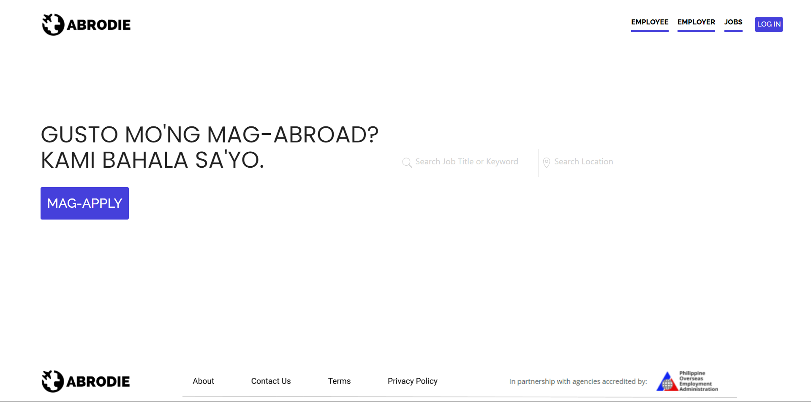
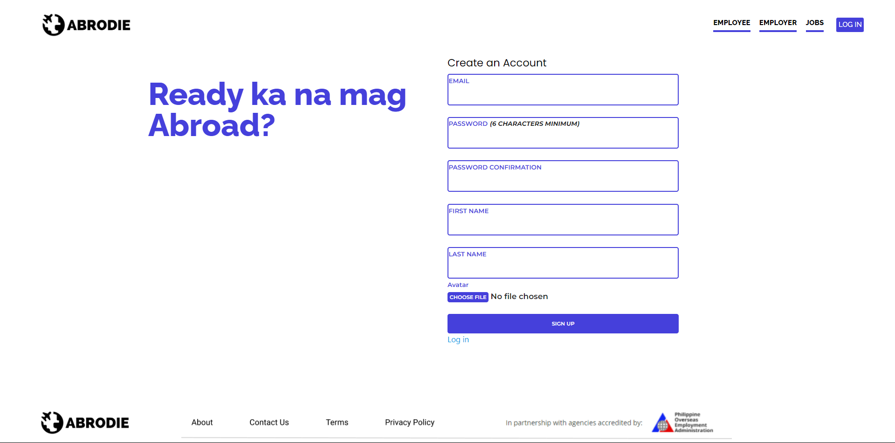
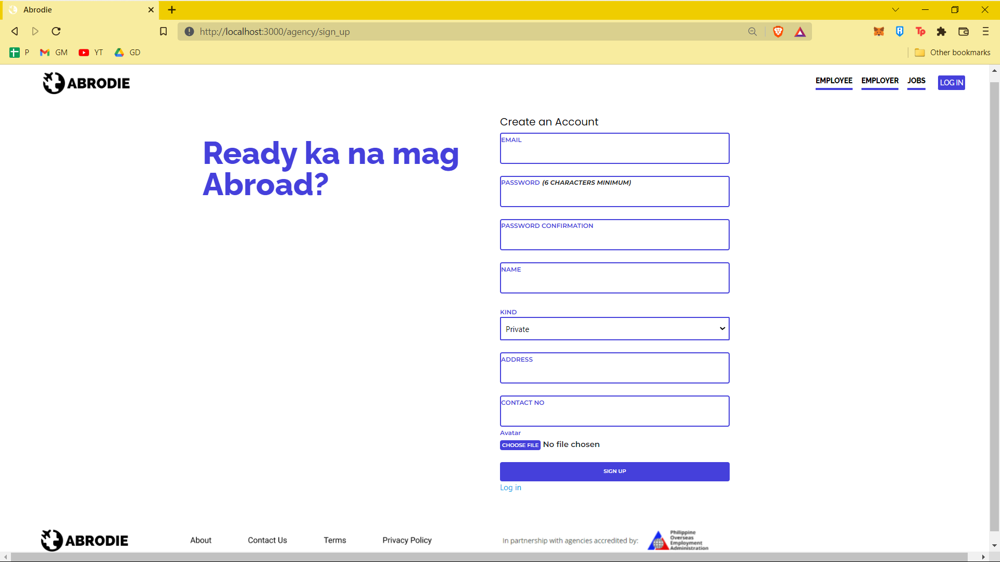
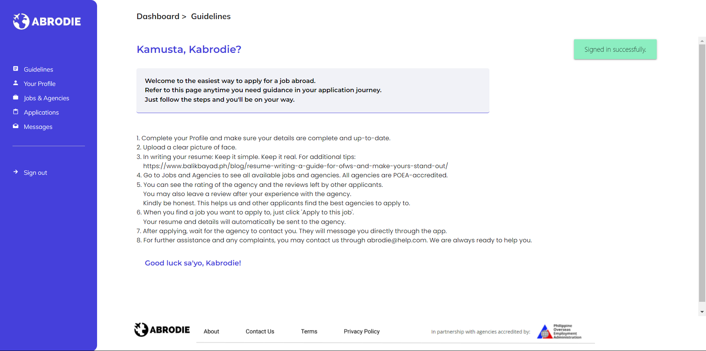

# ABRODIE: Recruitment Application

* Ruby version 2.7.4
* Rails version 7.0
* Materialize CSS
* Redis
* AWS S3
* Tested with RSpec

### Overview

Abrodie is an application made for manpower agencies and aspiring OFWs in the Philippines.

This application was made with the intention of providing the simplest and most efficient way to connect applicants of all technological literacy levels to POEA-accredited manpower agencies.

Both applicants and manpower agencies are able to register for accounts. 
Applicants only need to submit their updated resume and data.
Manpower agencies have to go through a screening process by the App Admin before being listed as verified in the app. 

### Features:

* Authentication (Log-in & Registration)
  
  
  
* Guidelines
  
* Real-time messaging
  
* Upload of Resume
* See jobs list (Applicant view and Agency view)
* Agencies list 
* Add Jobs (agency)
* Reviews of agencies
* Verify Agency (admin)

