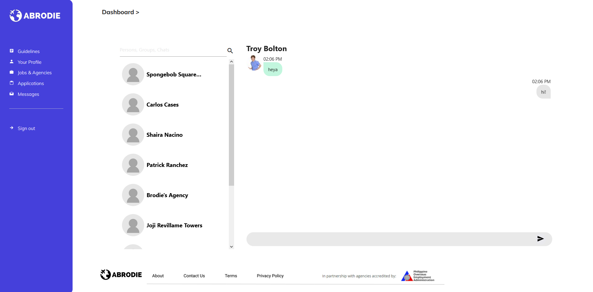
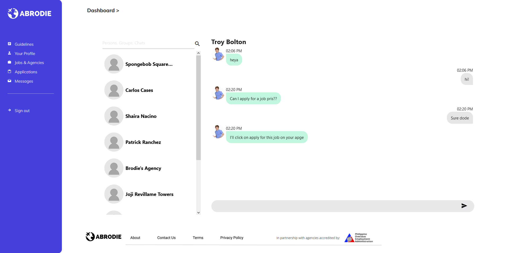
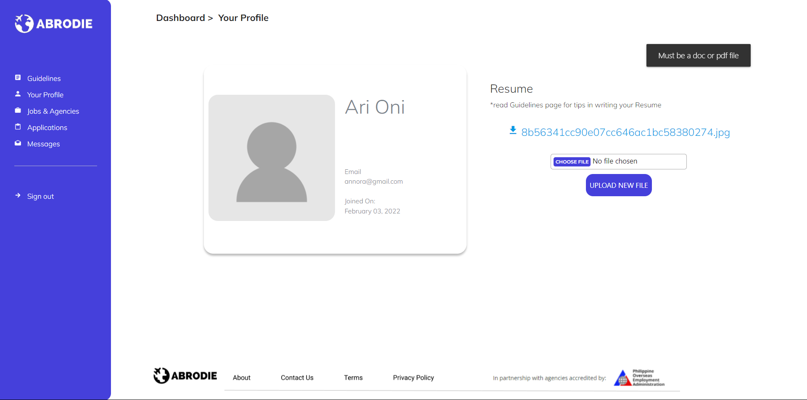

# ABRODIE: Recruitment Application

* Ruby version 2.7.4
* Rails version 7.0
* Materialize CSS
* Redis
* AWS S3
* Tested with RSpec

### Overview

Abrodie is an application made for manpower agencies and aspiring OFWs in the Philippines.

This application was made with the intention of providing the simplest and most efficient way to connect applicants of all technological literacy levels to POEA-accredited manpower agencies.

Both applicants and manpower agencies are able to register for accounts. 
Applicants only need to submit their updated resume and data.
Manpower agencies have to go through a screening process by the App Admin before being listed as verified in the app. 

<hr/>

### Features:

* Authentication (Log-in & Registration)

  
  
  
  
  
  
* Guidelines

  
  
* Real-time messaging

  
  
  
  
* Upload of Resume

  
  
* Jobs and Agencies List
  * Applicant View
  
  
  * Agency View
  
  
  * Add Jobs (agency)
  
  
* Agencies list (Admin)
 
  

* Applicant list

  

* Review of Agency
  
  
  
  

# API: Currency Conversion 

Base URL: Forex APIs to convert PHP to another currency
Convert to country
Convert PHP to the currency of the other country
Endpoint: convert_to_country

Example: Convert 20,000 PHP to Bulgarian currency (both amount and country are required)

Example URL: abrodie.herokuapp.com/api/convert_to_country?country=bulgaria&amount=20000
```
Response:
{
    "code": 200,
    "status": "success",
    "data": {
   	 "success": true,
   	 "terms": "https://currencylayer.com/terms",
   	 "privacy": "https://currencylayer.com/privacy",
   	 "timestamp": 1644826266,
   	 "source": "USD",
   	 "quotes": {
   		 "USDBGN": 1.725559,
   		 "USDPHP": 51.339497
   	 },
   	 "converted_amount": 672.2150004703007
    }
}
```

Convert to Currency

Convert PHP to the target currency
Endpoint: convert_to_currency
Example: Convert 20,000 PHP to MYR (Malaysian Ringgit) (both amount and currency code are required)

abrodie.herokuapp.com/api/convert_to_currency?currency=MYR&amount=20000

```
Response:
{
    "code": 200,
    "status": "success",
    "data": {
   	 "success": true,
   	 "terms": "https://currencylayer.com/terms",
   	 "privacy": "https://currencylayer.com/privacy",
   	 "timestamp": 1644826266,
   	 "source": "USD",
   	 "quotes": {
   		 "USDMYR": 4.189874,
   		 "USDPHP": 51.339497
   	 },
   	 "converted_amount": 1632.2224582761298
    }
}
```

# Roadmap

The following features are still in development/listed for improvement, and are meant to be released in a future version update: 

1. Search feature in Landing Page
2. Design-related
   - Footer
   - Applicant and Recruiter Profile
   - Message formatting
   - Responsiveness
3. Agency Verification (Admin)
4. Edit own account feature (Uploadinig profile picture and email)
6. Breadcrumbs improvements


